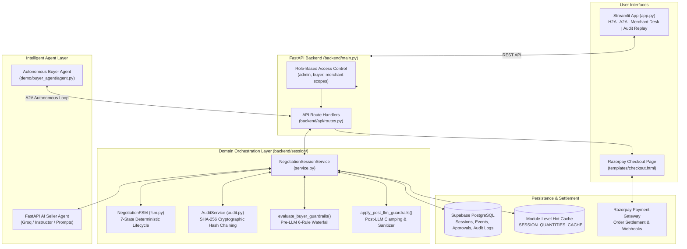
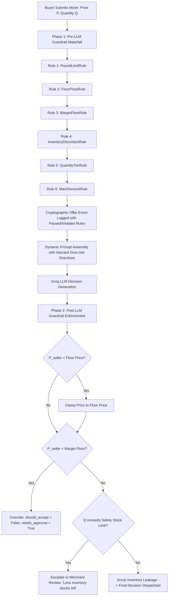
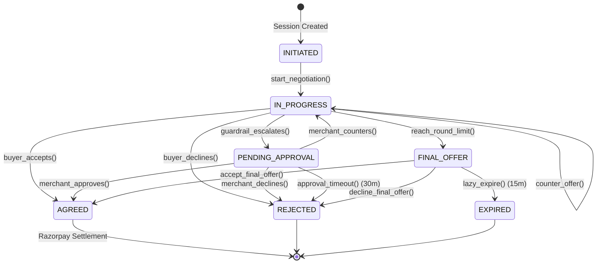
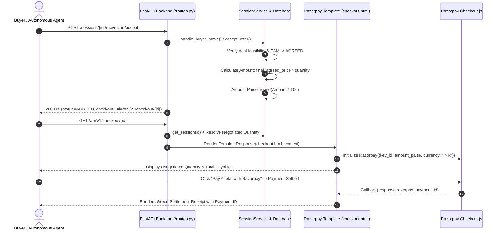

# 🤝 Handshake AI — Autonomous B2B Wholesale Negotiation Platform

[](https://www.python.org/)
[](https://fastapi.tiangolo.com/)
[](https://streamlit.io/)
[](https://groq.com/)
[](https://razorpay.com/)
[](https://supabase.com/)
[-brightgreen.svg)](./test_execution_results.txt)

> **Handshake AI** is an autonomous, multi-agent B2B wholesale pricing negotiation platform that bridges commercial flexibility with strict economic guardrails, cryptographic auditability, information asymmetry defense, and seamless Razorpay settlement.

---

## 📑 Table of Contents

- [Overview & Value Proposition](#-overview--value-proposition)
- [System Architecture](#-system-architecture)
- [Core Architectural Pillars](#-core-architectural-pillars)
  - [1. Two-Phase Guardrail Waterfall](#1-two-phase-guardrail-waterfall)
  - [2. Strict Information Asymmetry & Warehouse Non-Disclosure](#2-strict-information-asymmetry--warehouse-non-disclosure)
  - [3. Deterministic Finite State Machine (NegotiationFSM)](#3-deterministic-finite-state-machine-negotiationfsm)
  - [4. Cryptographic SHA-256 Tamper-Evident Audit Trail](#4-cryptographic-sha-256-tamper-evident-audit-trail)
  - [5. Competent Autonomous Buyer Agent (Outlay & Volume Math)](#5-competent-autonomous-buyer-agent-outlay--volume-math)
  - [6. Razorpay Standard Checkout Settlement](#6-razorpay-standard-checkout-settlement)
- [User Interfaces](#-user-interfaces)
  - [Interactive Streamlit Web Dashboard (`app.py`)](#interactive-streamlit-web-dashboard-apppy)
  - [High-Performance FastAPI REST API (`backend/main.py`)](#high-performance-fastapi-rest-api-backendmainpy)
- [Repository Structure](#-repository-structure)
- [Installation & Quickstart](#-installation--quickstart)
  - [Prerequisites](#prerequisites)
  - [Environment Configuration](#environment-configuration)
  - [Running the Application](#running-the-application)
- [Testing & Verification](#-testing--verification)
  - [Modular Verification Suite (`run_modular_tests.py`)](#modular-verification-suite-run_modular_testspy)
  - [Benchmark & Adversarial Testing](#benchmark--adversarial-testing)
  - [User Evaluation Manual & Fillable Scoring Rubrics](#user-evaluation-manual--fillable-scoring-rubrics)
- [API Reference](#-api-reference)
- [Academic Grounding & Citations](#-academic-grounding--citations)
- [License & Contributors](#-license--contributors)

---

## 🌟 Overview & Value Proposition

Traditional B2B wholesale procurement suffers from high friction: static catalog prices scare away high-volume buyers, while manual discount approval chains create delays spanning days or weeks. Conversely, unconstrained LLM negotiation bots hallucinate below-cost rates, leak sensitive warehouse inventory constraints, and fall prey to buyer lowballing.

**Handshake AI** resolves these fundamental challenges through an autonomous pair-negotiation architecture:

1. **Autonomous Margin Protection**: Enforces multi-tier waterfall rules (`floor_price`, `margin_floor`, `quantity_tiers`, `max_discount`) preventing any below-margin deal closure without executive merchant approval.
2. **Strict Information Asymmetry (PrefBench Grounded)**: Private warehouse inventory quantities and distress signals are strictly quarantined within internal reasoning; customer-facing messages frame allocations with commercial value anchoring.
3. **Multi-Objective Procurement Math**: Buyer agents optimize **Total Spend Outlay** ($P \times Q$) alongside unit price, resisting seller batch volume upselling and countering with budget-capped volume commitments.
4. **Cryptographic Accountability**: Every move, state transition, and guardrail decision is sealed into a SHA-256 cryptographic hash-chain ledger that can be mathematically verified at any time.
5. **Instant Payment Settlement**: Upon deal agreement (`AGREED`), the system directly generates a Razorpay Standard Checkout settlement page preserving the exact negotiated batch quantity and total price.

---

## 🏛️ System Architecture



---

## 🧩 Core Architectural Pillars

### 1. Two-Phase Guardrail Waterfall

Handshake AI implements a **Two-Phase Guardrail Waterfall** ensuring mathematical safety both before and after LLM inference:



- **6 Individual Rules**:
  - `FloorPriceRule`: Absolute hard bottom boundary; zero unit discounts permitted below this threshold.
  - `MarginFloorRule`: Cost plus minimum gross margin percentage ($Cost \times [1 + Margin\%]$); prices between floor and margin floor require executive merchant review.
  - `MaxDiscountRule`: Caps cumulative discount percentage allowable off list price.
  - `QuantityTierRule`: Enforces structured volume bracket pricing (e.g. 1–19 units: 0%, 20–49 units: 4%, 50–99 units: 8%).
  - `RoundLimitRule`: Enforces maximum round quota (default: 5 rounds) and triggers `FINAL_OFFER`.
  - `InventoryDiscretionRule`: Applies extra aging discounts for slow-moving warehouse inventory exceeding age thresholds.

---

### 2. Strict Information Asymmetry & Warehouse Non-Disclosure

In real-world B2B wholesale negotiations, disclosing warehouse stock levels or expressing urgency to "clear inventory" destroys seller surplus and triggers aggressive buyer lowballing.

- **Research Grounding**:
  - **PrefBench (arXiv:2605.22855)**: In asymmetric bargaining, reservation thresholds and private inventory levels must remain hidden.
  - **Supply Chain Dynamic Bargaining (arXiv:2608.07538)**: Under Perfect Bayesian Equilibrium, private inventory constraints must be shielded; sellers offer fixed allocation lots rather than admitting stock scarcity.
  - **Boulware Concession Pattern**: Price concessions diminish monotonically ($\Delta P_1 > \Delta P_2 > \Delta P_3$) to signal reservation boundaries without exposing formulas.
- **Dual-Channel Messaging**:
  - **Customer-Facing (`justification`)**: Zero mention of warehouse counts, "in stock", or distress phrasing ("clearance rate"). Instead, frames offers as **immediate priority allocation batches** backed by manufacturer warranty, dedicated logistics, and expedited fulfillment.
  - **Merchant Confidential Base (`internal_reasoning`)**: Full transparency for the merchant, documenting gross margin percentage preserved, carrying cost savings, and inventory turnover acceleration.
- **Automated Post-LLM Scrubbing**: In `backend/session/service.py` and `backend/session/guardrails.py`, regex filters detect and sanitize leaks (`"in stock"`, `"warehouse"`, `"clearance rate"`, `"remaining stock"`).
- **Safety Reserve Buffer (`buyer_quantity <= stock_quantity - 50`)**:
  - If fulfilling the order leaves $\ge 50$ units, bargaining proceeds normally.
  - If fulfilling leaves $< 50$ units (or exceeds total inventory), the session automatically halts, transitions to `PENDING_APPROVAL`, and presents:
    > *"Less inventory stocks left. Your requested order volume has been escalated for executive merchant review to verify allocation."*

---

### 3. Deterministic Finite State Machine (NegotiationFSM)

The negotiation lifecycle is governed by an explicit 7-state Finite State Machine ([`backend/session/fsm.py`](file:///f:/razorpay_hackathon/backend/session/fsm.py)) preventing illegal transitions:



---

### 4. Cryptographic SHA-256 Tamper-Evident Audit Trail

Every state transition, buyer proposal, seller counter-move, and merchant intervention is cryptographically chained using SHA-256 hash pointers ([`backend/session/audit.py`](file:///f:/razorpay_hackathon/backend/session/audit.py)):

$$H_i = \text{SHA-256}\left( H_{i-1} \,\|\, \text{session\_id} \,\|\, \text{event\_id} \,\|\, \text{canonical\_json}(\text{snapshot\_data}) \,\|\, \text{logged\_at} \right)$$

- **Genesis Seed**: $H_0 = \text{"GENESIS"}$.
- **Tamper Detection**: If any database entry or offer value is modified post-negotiation, recomputing the hash chain detects the modification.
- **Verification Endpoint**: `GET /sessions/{session_id}/verify` provides full mathematical validation with expected vs. recorded hashes for audit review.
- **Timeline Endpoint**: `GET /sessions/{session_id}/replay` provides a chronological event log of the negotiation.

---

### 5. Competent Autonomous Buyer Agent (Outlay & Volume Math)

In B2B wholesale commerce, buyers do not simply optimize unit prices—they manage **Working Capital, Total Spend Outlay, and Inventory Absorption Capacity**.

#### The Flaw in Heuristic Buyer Agents
When a buyer requests 35 units @ target ₹340 (Planned budget: ₹11,900, Max budget: ₹12,600) and the seller counters with unit price ₹320 but upsells volume to 50 units (Total outlay: ₹16,000), single-variable agents blindly accept because $320 \le 340$, ignoring that total outlay jumped by **+₹4,100 (+34.5%)**, blowing the cash budget.

#### Dual-Metric Mathematical Evaluation
The autonomous `BuyerAgent` ([`demo/buyer_agent/agent.py`](file:///f:/razorpay_hackathon/demo/buyer_agent/agent.py)) enforces a multi-objective utility boundary:

$$\text{Acceptance Criterion: } (P_{\text{seller}} \le P_{\text{walkaway}}) \land (P_{\text{seller}} \times Q_{\text{seller}} \le B_{\text{max}}) \land (Q_{\text{seller}} \le Q_{\text{max}})$$

#### Tactical Counter-Logrolling
When the seller offers a low unit rate but demands an inflated batch volume:
1. Buyer agent **rejects immediate acceptance** (`should_accept = False`).
2. Buyer calculates the maximum affordable batch size at the seller's discounted unit rate:
   $$Q_{\text{counter}} = \min\left(Q_{\text{max}}, \left\lfloor \frac{B_{\text{max}}}{P_{\text{seller}}} \right\rfloor\right)$$
3. Buyer counters: *"We appreciate the ₹320 rate, but our order cap is strictly 35 units. We can commit to 39 units at ₹320 (Total ₹12,480) if confirmed today."*
4. **Post-LLM Safety Guardrail**: If an LLM incorrectly flags `should_accept = True` on an offer that exceeds $B_{\text{max}}$, the guardrail overrides acceptance, clamps volume to budget capacity, and recalculates total outlay.

---

### 6. Razorpay Standard Checkout Settlement

Upon reaching the `AGREED` state, Handshake AI instantly generates an checkout settlement page:



- **Multi-Layer Volume & Spend Preservation**:
  1. `_SESSION_QUANTITIES_CACHE`: Module-level shared memory preserves negotiated volumes across requests.
  2. `offer_events` Database Fallback: Automatically resolves the latest round's negotiated quantity from Supabase if cache misses occur.
  3. Domain Guard: `NegotiationSessionService.get_session()` ensures `session.quantity` matches agreed quantities.
  4. Template Hardening: Injects exact server-side computed `amount`, `amount_paise`, and `quantity` into `checkout.html`.

---

## 💻 User Interfaces

### Interactive Streamlit Web Dashboard (`app.py`)

Launch the web console with:
```powershell
streamlit run app.py
```

Features 4 specialized operating modes:

1. **🤝 Human-to-Agent (H2A) Negotiation**:
   - Live interactive chat interface between human procurement buyer and the AI Seller Agent.
   - Real-time metric cards showing active round, seller counter-offer, and buyer anchor offer.
   - Action controls: *Submit Counter-Offer*, *Accept Seller Offer*, *Walk Away*.
   - Instant transition to Razorpay settlement upon deal acceptance.
2. **🤖 Autonomous Agent-to-Agent (A2A) Negotiation**:
   - Autonomous Groq LLM Buyer Agent bargaining round-by-round against the AI Seller Agent.
   - Real-time streaming of buyer reasoning, unit offer price, batch quantity, and total cash spend.
   - Auto-merchant resolution toggle for demoing bulk escalations seamlessly.
3. **👔 Executive Merchant Review Desk**:
   - Interface for merchants to inspect deals flagged as `PENDING_APPROVAL` (due to below-margin rates or safety reserve stock buffer breaches).
   - Options to *Approve*, *Reject*, or submit custom *Merchant Counter-Offers*.
4. **🔍 Replay & Cryptographic Audit Verification**:
   - Interactive chronological story timeline of every offer, counter-offer, and state transition.
   - Per-entry SHA-256 cryptographic hash-chain validation table displaying recorded vs. expected hashes.
5. **🔐 Sidebar API Key & Endpoint Vault**:
   - Secure input for Admin, Buyer, and Merchant API keys stored in session state.
   - Backend URL ping monitor and live health status indicator.

---

### High-Performance FastAPI REST API (`backend/main.py`)

Run the server with:
```powershell
uvicorn backend.main:app --reload --port 8000
```
- **Interactive Swagger Docs**: `http://localhost:8000/docs`
- **ReDoc Technical Schema**: `http://localhost:8000/redoc`
- **Role-Based Scopes**: Enforced via `X-API-Key` headers (`admin:create_session`, `buyer:negotiate`, `buyer:accept`, `merchant:approve`, `audit:read`).

---

## 📁 Repository Structure

```text
Handshake-AI/
├── .env                                        # Environment configuration (API keys, Supabase, Razorpay)
├── requirements.txt                            # Python dependencies
├── app.py                                      # Streamlit interactive frontend dashboard
├── run_modular_tests.py                        # 19-test multi-tier automated test suite runner
├── test_execution_results.txt                  # Full output log of modular test suite
├── B2B_Negotiation_User_Testing_Guide_and_Rubrics.docx  # User manual, golden paths, and fillable rubrics
├── test_benchmark_suite.md                     # Pytest benchmark and adversarial test documentation
│
├── backend/                                    # Core Backend API & Domain Services
│   ├── main.py                                 # FastAPI application entrypoint and middleware
│   ├── api/                                    # HTTP Routing & Authentication
│   │   ├── auth.py                             # API key validation and scope-based RBAC
│   │   ├── routes.py                           # Session, Move, Accept, Merchant, Replay, Checkout routes
│   │   └── schemas.py                          # Pydantic HTTP request and response schemas
│   ├── guardrail/                              # Pricing Guardrail Engine
│   │   ├── base.py                             # Abstract PricingRule and Offer dataclasses
│   │   ├── engine.py                           # GuardrailEngine waterfall orchestration
│   │   └── rules/                              # 6 Specialized Pricing Rules
│   │       ├── floor_price_rule.py             # Absolute floor price rule
│   │       ├── margin_floor_rule.py            # Minimum gross margin percentage rule
│   │       ├── max_discount_rule.py            # Maximum discount ceiling rule
│   │       ├── quantity_tier_rule.py           # Quantity bracket discount rule
│   │       ├── round_limit_rule.py             # Max negotiation rounds rule
│   │       └── inventory_discretion_rule.py    # Aged stock extra discount rule
│   ├── models/                                 # Domain Data Models
│   │   ├── catalog.py                          # CatalogItem schema
│   │   ├── intent.py                           # Buyer intent and trade-off models
│   │   └── pricing_policy.py                   # PricingPolicy, QuantityTier, InventoryDiscretion schemas
│   └── session/                                # Negotiation Session Orchestration
│       ├── audit.py                            # SHA-256 cryptographic audit chaining service
│       ├── db.py                               # BaseSessionRepository, InMemory & Supabase repositories
│       ├── fsm.py                              # 7-State NegotiationFSM state machine
│       ├── guardrails.py                       # Pre-LLM evaluation & Post-LLM enforcement
│       ├── models.py                           # NegotiationDecision, BuyerMove, SessionResponse schemas
│       ├── prompts.py                          # Harvard "Give-Get" prompt templates & logrolling logic
│       └── service.py                          # Core NegotiationSessionService lifecycle orchestrator
│
├── demo/                                       # Standalone Demonstrations & Agents
│   ├── a2a_demo.py                             # Terminal-based Agent-to-Agent negotiation runner
│   ├── seed_api_keys.py                        # Utility script to generate API keys in Supabase
│   └── buyer_agent/                            # Autonomous Procurement Buyer Agent
│       ├── agent.py                            # BuyerAgent class with total spend guardrails
│       ├── models.py                           # BuyerDecision schema with offer_quantity & total_outlay
│       └── prompts.py                          # Multi-objective budget and volume breakdown prompts
│
├── data/                                       # Catalog & Policy Seed Data
│   ├── catalog.yaml                            # Product catalog with base prices, descriptions, stock
│   └── pricing_policy.yaml                     # SKUs floor prices, margin floors, and volume tiers
│
├── templates/                                  # HTML Templates
│   └── checkout.html                           # Dark-themed Razorpay Standard Checkout settlement page
│
├── scripts/                                    # Automation Scripts
│   └── generate_user_test_doc.py               # Generates the Word manual and scoring rubrics (.docx)
│
└── tests/                                      # Pytest Automated Test Suite
    ├── conftest.py                             # Shared pytest fixtures
    ├── test_api.py                             # FastAPI endpoint integration tests
    ├── test_benchmark.py                       # Statistical benchmark, AOV, and adversarial tests
    ├── test_buyer_agent.py                     # Buyer agent budget and strategy tests
    ├── test_guardrail.py                       # Guardrail waterfall unit tests
    ├── test_session.py                         # FSM and SessionService tests
    └── test_supabase_integration.py            # Supabase database connectivity tests
```

---

## 🚀 Installation & Quickstart

### Prerequisites

- **Python 3.10+** (Tested on Python 3.11, 3.12, 3.13)
- **Groq API Key** (for fast Llama-3 / GPT-OSS inference)
- **Supabase Account & Database** (optional, InMemory fallback included)
- **Razorpay Key ID & Secret** (test mode supported)

---

### Environment Configuration

Create a `.env` file in the root directory:

```ini
# Supabase Configuration
SUPABASE_URL=https://your-project.supabase.co
SUPABASE_PUBLISHABLE_KEY=your-supabase-publishable-key
SUPABASE_SECRET_KEY=your-supabase-secret-key

# Groq LLM Configuration
GROQ_API_KEY=gsk_your_groq_api_key
GROQ_MODEL=openai/gpt-oss-120b

# Razorpay Settlement Configuration
RAZORPAY_KEY_ID=rzp_test_your_key_id
RAZORPAY_KEY_SECRET=your_razorpay_key_secret

# Role-Based API Keys (generate or use seeded keys)
ADMIN_KEY=8jaMvDxYsTqKFU9plb10gnoCiLyV9ZWb4vr_5ZIL7yY
BUYER_KEY=jqL7zF7oQxCK8J-fCfSc_5K1GZH08EaJgyc3AcpCBJM
MERCHANT_KEY=CDBGRMvnoyJssjWhYyA96AZrLIbQuy7vk6QbDHW5hkU

# A2A Demo Configuration Defaults
SKU_CODE=TSH-PREM-001
QUANTITY=50
TARGET_PRICE=1150
WALK_AWAY_PRICE=1350
OPENING_OFFER=950
AUTO_MERCHANT=true
AUTO_MERCHANT_ACTION=approve
```

---

### Running the Application

#### 1. Install Dependencies
```powershell
python -m venv .venv
.venv\Scripts\activate
pip install -r requirements.txt
```

#### 2. Start the FastAPI Backend
```powershell
uvicorn backend.main:app --reload --port 8000
```

#### 3. Start the Streamlit Dashboard (in a separate terminal)
```powershell
streamlit run app.py
```
Open your browser at `http://localhost:8501`.

#### 4. Run the Standalone A2A Terminal Demo
```powershell
python demo/a2a_demo.py
```

---

## 🧪 Testing & Verification

### Modular Verification Suite (`run_modular_tests.py`)

Handshake AI includes an automated, self-documenting test suite that executes across three progressive tiers and outputs to [`test_execution_results.txt`](file:///f:/razorpay_hackathon/test_execution_results.txt):

```powershell
python run_modular_tests.py
```

```text
================================================================================
  HANDSHAKE AI -- MODULAR SYSTEM TEST SUITE
================================================================================
  Platform      : win32 | Python 3.13.2
  Output Log    : test_execution_results.txt
================================================================================

################################################################################
  TIER 1: INDEPENDENT MODULE VERIFICATION (UNIT ISOLATION)
################################################################################
[RUNNING] [Tier 1] 1.1 CatalogItem & PricingPolicy Pydantic Models ...        --> PASS
[RUNNING] [Tier 1] 1.2 PricingRule Subclasses (6 Individual Rules) ...        --> PASS
[RUNNING] [Tier 1] 1.3 GuardrailEngine Waterfall Composition ...              --> PASS
[RUNNING] [Tier 1] 1.4 NegotiationFSM States & Illegal Transition Guards ...  --> PASS
[RUNNING] [Tier 1] 1.5 AuditService SHA-256 Hash Chaining & Tamper Detection --> PASS
[RUNNING] [Tier 1] 1.6 Post-LLM Guardrail & Inventory Sanitizer ...           --> PASS
[RUNNING] [Tier 1] 1.7 AuthenticatedClient Role Scope Enforcement ...         --> PASS
[RUNNING] [Tier 1] 1.8 API Response & Schema Serialization ...                 --> PASS

################################################################################
  TIER 2: COMBINED MODULE INTEGRATION (PAIRWISE & SUBSYSTEMS)
################################################################################
[RUNNING] [Tier 2] 2.1 Combined: FSM Transitions + Cryptographic Audit ...    --> PASS
[RUNNING] [Tier 2] 2.2 Combined: Pre-LLM Guardrails + Post-LLM Clamping ...   --> PASS
[RUNNING] [Tier 2] 2.3 Combined: Safety Reserve Buffer (stock-50) Escalation  --> PASS
[RUNNING] [Tier 2] 2.4 Combined: Session Orchestrator + Repository ...         --> PASS
[RUNNING] [Tier 2] 2.5 Combined: FastAPI Route Handlers + Template Checkout . --> PASS
[RUNNING] [Tier 2] 2.6 Combined: Buyer Agent Total Outlay & Budget Cap ...     --> PASS
[RUNNING] [Tier 2] 2.7 Combined: A2A Negotiated Quantity Checkout Settlement   --> PASS

################################################################################
  TIER 3: END-TO-END GOLDEN SCENARIO SIMULATIONS
################################################################################
[RUNNING] [Tier 3] 3.1 E2E Scenario 1: Standard Wholesale Bargain ...         --> PASS
[RUNNING] [Tier 3] 3.2 E2E Scenario 2: Safety Stock Deficit -> Escalation ... --> PASS
[RUNNING] [Tier 3] 3.3 E2E Scenario 3: Aggressive Lowball Floor Defense ...   --> PASS
[RUNNING] [Tier 3] 3.4 E2E Scenario 4: Buyer Walkout / Negotiation Decline .  --> PASS

================================================================================
  TEST EXECUTION SUMMARY: 19/19 PASSED (100.0% SUCCESS RATE)
================================================================================
```

---

### Benchmark & Adversarial Testing

Run the statistical benchmark and adversarial robustness suite:
```powershell
pytest tests/test_benchmark.py -v --tb=short
```
- Tracks **AOV (Average Order Value)** vs static catalog baseline.
- Validates **Gross Margin %** preservation across stochastic LLM outputs.
- Verifies **Zero Floor Price Breaches** across adversarial lowball attacks.

---

### User Evaluation Manual & Fillable Scoring Rubrics

The repository includes a testing guide formatted as a Microsoft Word document:
- **File**: [`B2B_Negotiation_User_Testing_Guide_and_Rubrics.docx`](file:///f:/razorpay_hackathon/B2B_Negotiation_User_Testing_Guide_and_Rubrics.docx)
- **Regenerate**:
  ```powershell
  python scripts/generate_user_test_doc.py
  ```
- **Included Content**:
  - Step-by-step evaluation protocol for manual human testing.
  - 5 Golden Path Test Cases with exact ideal buyer prompts and system responses.
  - 5 Structured Scoring Rubric Worksheets (100 points total) evaluating:
    1. *Strategic Bargaining & Harvard 'Give-Get' Principles (25 Pts)*
    2. *Information Asymmetry & Non-Disclosure (20 Pts)*
    3. *Guardrail Enforcement & Mathematical Margins (20 Pts)*
    4. *Autonomous FSM State Transitions & Expiries (15 Pts)*
    5. *Cryptographic Hash-Chain Audit & Verification (20 Pts)*

---

## 📡 API Reference

| Method | Endpoint | Required Scope | Description |
|---|---|---|---|
| `POST` | `/api/v1/sessions` | `admin:create_session` | Initialize a new negotiation session for a SKU and buyer. |
| `GET` | `/api/v1/sessions/{session_id}` | `session:read` | Retrieve live session status, rounds, prices, and quantities. |
| `POST` | `/api/v1/sessions/{session_id}/moves` | `buyer:negotiate` | Submit buyer proposal; evaluates guardrails and returns counter-offer. |
| `POST` | `/api/v1/sessions/{session_id}/accept` | `buyer:accept` | Buyer explicitly accepts seller's latest counter-offer. |
| `POST` | `/api/v1/sessions/{session_id}/decline` | `buyer:negotiate` | Buyer walks away, terminating negotiation into `REJECTED` state. |
| `POST` | `/api/v1/sessions/{session_id}/merchant-decision` | `merchant:{action}` | Executive merchant action: `approve`, `reject`, or `counter`. |
| `GET` | `/api/v1/sessions/{session_id}/audit` | `audit:read` | Fetch tamper-evident cryptographic SHA-256 audit log. |
| `GET` | `/api/v1/sessions/{session_id}/replay` | `audit:read` | Chronological story timeline of all negotiation events. |
| `GET` | `/api/v1/sessions/{session_id}/verify` | `audit:read` | Cryptographic verification proof (recomputed vs recorded hashes). |
| `GET` | `/api/v1/checkout/{session_id}` | *Public (Bypassed)* | Render minimal Razorpay Standard Checkout settlement page. |
| `GET` | `/api/v1/health` | *Public (Bypassed)* | Health check returning service status and active engine version. |

---

## 📚 Academic Grounding & Citations

The behavioral, economic, and security architecture of Handshake AI is grounded in recent literature on game theory and autonomous agents:

1. **PrefBench: Benchmarking Preference Elicitation in Multi-Agent Negotiation** (arXiv:2605.22855)
   - *Application*: Enforces strict information asymmetry. Private inventory counts and distress signals are quarantined to internal merchant reasoning, preventing opportunistic buyer lowballing.
2. **Dynamic Bargaining under Asymmetric Information in Supply Chains** (arXiv:2608.07538)
   - *Application*: Grounds the logrolling and volume allocation mechanisms. Counter-offers frame inventory batches as priority allocations rather than warehouse surpluses.
3. **AgenticPay: Autonomous Agent Negotiation with Multi-Rail Payment Settlement** (arXiv:2602.06008)
   - *Application*: Establishes dual-metric buyer evaluation (Unit Price $\le$ Reservation Price $\land$ Total Outlay $\le$ Budget Cap) and automated handoff to settlement rails (Razorpay Standard Checkout).
4. **Getting to Yes: Negotiating Agreement Without Giving In** (Fisher, Ury & Patton, Harvard Negotiation Project)
   - *Application*: Informs the "Give-Get" prompt design: the seller never concedes on unit price without demanding a commercial trade-off (higher batch volume, 7-day payment terms, repeat ordering).

---

## 📄 License & Contributors

- **Repository**: [https://github.com/sriKritarth/Handshake-AI](https://github.com/sriKritarth/Handshake-AI)
- **Author**: Sri Kritarth & Team Handshake AI
- **License**: MIT License. Open source for hackathons, research, and enterprise autonomous commerce evaluations.
