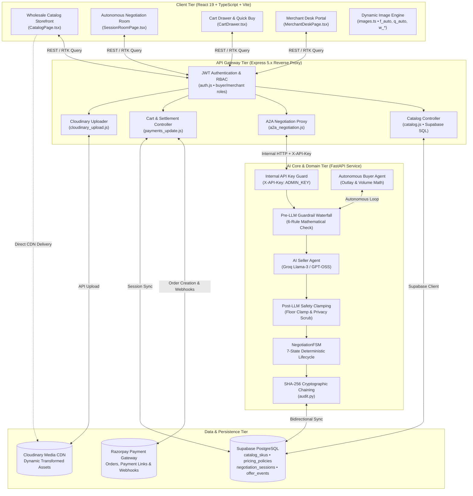
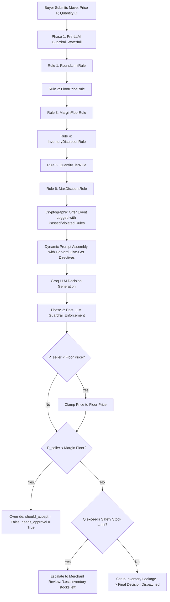
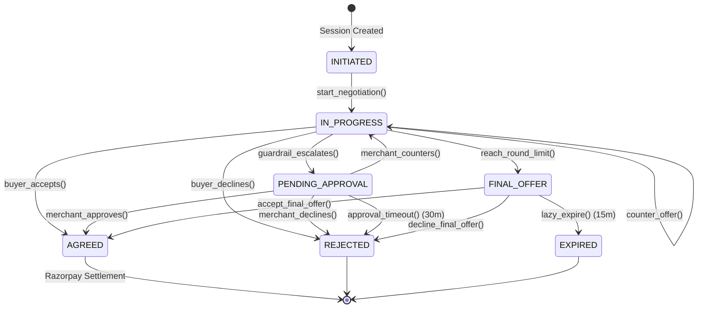
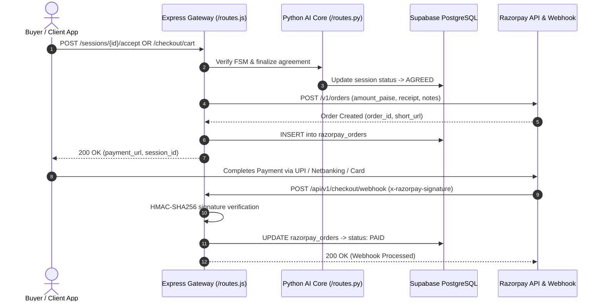

# 🤝 Handshake AI — Enterprise Autonomous B2B Wholesale Platform

[](https://react.dev/)
[](https://expressjs.com/)
[](https://fastapi.tiangolo.com/)
[](https://groq.com/)
[](https://cloudinary.com/)
[](https://razorpay.com/)
[](https://supabase.com/)

> **Handshake AI** is a production-grade, autonomous B2B commerce platform engineered for high-volume wholesale procurement. It replaces rigid static pricing and slow manual discount approval cycles with bilateral AI agent negotiation, deterministic margin protection waterfalls, cryptographic audit chains, high-performance dynamic asset delivery, and instant digital payment settlement.

---

## 📑 Table of Contents

- [Executive Product Overview](#-executive-product-overview)
  - [The Commercial Problem](#the-commercial-problem)
  - [The Handshake AI Solution](#the-handshake-ai-solution)
  - [Target Ecosystem & Value Drivers](#target-ecosystem--value-drivers)
- [Enterprise 3-Tier Architecture](#-enterprise-3-tier-architecture)
- [Core Architectural Pillars](#-core-architectural-pillars)
  - [1. Two-Phase Guardrail Waterfall](#1-two-phase-guardrail-waterfall)
  - [2. Strict Information Asymmetry & Warehouse Non-Disclosure](#2-strict-information-asymmetry--warehouse-non-disclosure)
  - [3. Deterministic Finite State Machine (NegotiationFSM)](#3-deterministic-finite-state-machine-negotiationfsm)
  - [4. Cryptographic SHA-256 Tamper-Evident Audit Trail](#4-cryptographic-sha-256-tamper-evident-audit-trail)
  - [5. Competent Autonomous Buyer Agent (Outlay & Volume Math)](#5-competent-autonomous-buyer-agent-outlay--volume-math)
  - [6. High-Performance Cloudinary Dynamic Delivery Engine](#6-high-performance-cloudinary-dynamic-delivery-engine)
  - [7. Instant Payment Settlement & Webhook Verification](#7-instant-payment-settlement--webhook-verification)
- [Portals & User Workflows](#-portals--user-workflows)
  - [Wholesale Storefront & Catalog](#wholesale-storefront--catalog)
  - [Autonomous Negotiation Room](#autonomous-negotiation-room)
  - [Executive Merchant Review Desk](#executive-merchant-review-desk)
  - [Shopping Cart & Instant Direct Checkout](#shopping-cart--instant-direct-checkout)
- [Repository Structure](#-repository-structure)
- [Production Deployment & Configuration](#-production-deployment--configuration)
  - [Architecture Topology](#architecture-topology)
  - [Environment Variables Specification](#environment-variables-specification)
  - [Microservice Orchestration Guide](#microservice-orchestration-guide)
  - [Health Probes & Readiness Checks](#health-probes--readiness-checks)
- [API Gateway Reference](#-api-gateway-reference)
- [Database Relational Integrity & Schema](#-database-relational-integrity--schema)
- [Academic Grounding & Game-Theoretic Research](#-academic-grounding--game-theoretic-research)
- [License & Authors](#-license--authors)

---

## 🌟 Executive Product Overview

### The Commercial Problem
In enterprise B2B wholesale procurement, static price lists fail to reflect real market dynamics:
1. **Lost Deal Velocity**: Enterprise buyers purchasing in volume expect tiered quantity discounts. Static storefront prices force them to initiate manual sales inquiries, extending lead-to-close times by days or weeks.
2. **Margin Erosion**: Human sales teams frequently concede excessive ad-hoc discounts near end-of-quarter deadlines without mathematical verification of product gross margins.
3. **Chatbot Hallucinations**: Standard generative AI chatbots lack economic boundaries; when prompted, they hallucinate below-cost rates, leak sensitive warehouse inventory levels, and accept absurd lowball offers.

### The Handshake AI Solution
**Handshake AI** bridges commercial flexibility with enterprise guardrails through an autonomous pair-negotiation engine:
* **Bilateral Agent-to-Agent Bargaining**: Procurement buyer agents and merchant seller agents negotiate price and quantity in real time using Harvard "Give-Get" negotiation frameworks and game-theoretic concession patterns.
* **Dual-Tier Mathematical Waterfalls**: Strict algorithmic boundaries clamp prices to guaranteed floor limits before and after any language model generates an offer.
* **Information Asymmetry Quarantine**: Private seller parameters (unit cost price, floor margin, warehouse distress levels) remain segregated in internal merchant reasoning and are mathematically barred from outward buyer messages.
* **Zero-Intervention Order Finalization**: Once mutual agreement is reached, an immutable order snapshot and Razorpay checkout session are automatically instantiated.

### Target Ecosystem & Value Drivers
* **B2B Distributors & Manufacturers**: Liquidate inventory lots and capture high-volume buyer orders automatically with 100% margin floor protection.
* **Bulk Procurement Platforms**: Empower corporate purchasing agents to secure volume-tailored pricing without human telephone friction.
* **Enterprise Marketplaces**: Provide dynamic counter-bargaining and automated escrow settlement as a native infrastructure primitive.

---

## 🏛️ Enterprise 3-Tier Architecture


```mermaid
flowchart TB
    subgraph CLIENT["Client Tier (React 19 + TypeScript + Vite)"]
        STORE["Wholesale Catalog Storefront<br/>(CatalogPage.tsx)"]
        ROOM["Autonomous Negotiation Room<br/>(SessionRoomPage.tsx)"]
        CART["Cart Drawer & Quick Buy<br/>(CartDrawer.tsx)"]
        MERCH_UI["Merchant Desk Portal<br/>(MerchantDeskPage.tsx)"]
        IMG_CACHE["Dynamic Image Engine<br/>(images.ts • f_auto, q_auto, w_*)"]
    end

    subgraph GATEWAY["API Gateway Tier (Express 5.x Reverse Proxy)"]
        AUTH_MW["JWT Authentication & RBAC<br/>(auth.js • buyer/merchant roles)"]
        CATALOG_CTL["Catalog Controller<br/>(catalog.js • Supabase SQL)"]
        A2A_PROXY["A2A Negotiation Proxy<br/>(a2a_negotiation.js)"]
        PAY_CTL["Cart & Settlement Controller<br/>(payments_update.js)"]
        CLDN_CTL["Cloudinary Uploader<br/>(cloudinary_upload.js)"]
    end

    subgraph ENGINE["AI Core & Domain Tier (FastAPI Service)"]
        AUTH_KEY["Internal API Key Guard<br/>(X-API-Key: ADMIN_KEY)"]
        FSM["NegotiationFSM<br/>7-State Deterministic Lifecycle"]
        PRE_GUARD["Pre-LLM Guardrail Waterfall<br/>(6-Rule Mathematical Check)"]
        LLM_SELLER["AI Seller Agent<br/>(Groq Llama-3 / GPT-OSS)"]
        POST_GUARD["Post-LLM Safety Clamping<br/>(Floor Clamp & Privacy Scrub)"]
        BUYER_AGENT["Autonomous Buyer Agent<br/>(Outlay & Volume Math)"]
        AUDIT_CHAIN["SHA-256 Cryptographic Chaining<br/>(audit.py)"]
    end

    subgraph DATA["Data & Persistence Tier"]
        SUPA[("Supabase PostgreSQL<br/>catalog_skus • pricing_policies<br/>negotiation_sessions • offer_events")]
        CLDN[("Cloudinary Media CDN<br/>Dynamic Transformed Assets")]
        RZP[("Razorpay Payment Gateway<br/>Orders, Payment Links & Webhooks")]
    end

    STORE <-->|REST / RTK Query| AUTH_MW
    ROOM <-->|REST / RTK Query| AUTH_MW
    CART <-->|REST / RTK Query| AUTH_MW
    MERCH_UI <-->|REST / RTK Query| AUTH_MW
    STORE -.->|Direct CDN Delivery| CLDN

    AUTH_MW --> CATALOG_CTL
    AUTH_MW --> A2A_PROXY
    AUTH_MW --> PAY_CTL
    AUTH_MW --> CLDN_CTL

    CATALOG_CTL <-->|Supabase Client| SUPA
    CLDN_CTL <-->|API Upload| CLDN
    PAY_CTL <-->|Order Creation & Webhooks| RZP
    PAY_CTL <-->|Session Sync| SUPA

    A2A_PROXY <-->|Internal HTTP + X-API-Key| AUTH_KEY
    AUTH_KEY --> PRE_GUARD
    PRE_GUARD --> LLM_SELLER
    LLM_SELLER --> POST_GUARD
    POST_GUARD --> FSM
    FSM --> AUDIT_CHAIN
    AUDIT_CHAIN <-->|Bidirectional Sync| SUPA
    BUYER_AGENT <-->|Autonomous Loop| PRE_GUARD
```

---

## 🧩 Core Architectural Pillars

### 1. Two-Phase Guardrail Waterfall

Handshake AI enforces mathematical safety at two distinct boundaries during every negotiation turn:


```mermaid
flowchart TD
    A[Buyer Submits Move: Price P, Quantity Q] --> B[Phase 1: Pre-LLM Guardrail Waterfall]
    B --> R1[Rule 1: RoundLimitRule]
    R1 --> R2[Rule 2: FloorPriceRule]
    R2 --> R3[Rule 3: MarginFloorRule]
    R3 --> R4[Rule 4: InventoryDiscretionRule]
    R4 --> R5[Rule 5: QuantityTierRule]
    R5 --> R6[Rule 6: MaxDiscountRule]
    R6 --> C[Cryptographic Offer Event Logged with Passed/Violated Rules]
    
    C --> D[Dynamic Prompt Assembly with Harvard Give-Get Directives]
    D --> E[Groq LLM Decision Generation]
    
    E --> F[Phase 2: Post-LLM Guardrail Enforcement]
    F --> G{P_seller < Floor Price?}
    G -- Yes --> H[Clamp Price to Floor Price]
    G -- No --> I{P_seller < Margin Floor?}
    H --> I
    I -- Yes --> J[Override: should_accept = False, needs_approval = True]
    I -- No --> K{Q exceeds Safety Stock Limit?}
    K -- Yes --> L[Escalate to Merchant Review: 'Less inventory stocks left']
    K -- No --> M[Scrub Inventory Leakage -> Final Decision Dispatched]
```

- **6 Individual Rules**:
  - `FloorPriceRule`: Absolute hard bottom boundary; zero unit discounts permitted below this threshold under any circumstance.
  - `MarginFloorRule`: Cost plus minimum gross margin percentage (Cost × [1 + Margin%]); prices between floor and margin floor require executive merchant review.
  - `MaxDiscountRule`: Caps cumulative discount percentage allowable off catalog list price.
  - `QuantityTierRule`: Enforces structured volume bracket pricing (e.g., 1–19 units: 0%, 20–49 units: 4%, 50–99 units: 8%).
  - `RoundLimitRule`: Enforces maximum round quota (default: 5 rounds) and triggers `FINAL_OFFER`.
  - `InventoryDiscretionRule`: Applies extra aging discounts for slow-moving warehouse inventory exceeding age thresholds.

---

### 2. Strict Information Asymmetry & Warehouse Non-Disclosure

In enterprise wholesale, revealing remaining stock or urgency to "move inventory" destroys seller pricing power and invites lowballing.

- **Research Grounding**:
  - **PrefBench (arXiv:2605.22855)**: In asymmetric bargaining, reservation thresholds and private inventory levels must remain hidden.
  - **Supply Chain Dynamic Bargaining (arXiv:2608.07538)**: Under Perfect Bayesian Equilibrium, private inventory constraints must be shielded; sellers offer fixed allocation lots rather than admitting stock scarcity.
  - **Boulware Concession Pattern**: Price concessions diminish monotonically (ΔP₁ > ΔP₂ > ΔP₃) to signal reservation boundaries without exposing formulas.
- **Dual-Channel Messaging**:
  - **Customer-Facing (`justification`)**: Zero mention of warehouse counts, "in stock", or distress phrasing ("clearance rate"). Instead, frames offers as **immediate priority allocation batches** backed by manufacturer warranty, dedicated logistics, and expedited fulfillment.
  - **Merchant Confidential Base (`internal_reasoning`)**: Full transparency for the merchant, documenting gross margin percentage preserved, carrying cost savings, and inventory turnover acceleration.
- **Automated Post-LLM Scrubbing**: In `backend/session/service.py` and `backend/session/guardrails.py`, regex filters detect and sanitize leaks (`"in stock"`, `"warehouse"`, `"clearance rate"`, `"remaining stock"`).
- **Safety Reserve Buffer (`buyer_quantity <= stock_quantity - 50`)**:
  - If fulfilling the order leaves ≥ 50 units, bargaining proceeds normally.
  - If fulfilling leaves < 50 units (or exceeds total inventory), the session automatically halts, transitions to `PENDING_APPROVAL`, and presents client-friendly messaging.

---

### 3. Deterministic Finite State Machine (NegotiationFSM)

The negotiation lifecycle is governed by an explicit 7-state Finite State Machine ([`backend/session/fsm.py`](file:///f:/razorpay_hackathon/backend/session/fsm.py)) preventing illegal transitions:


```mermaid
stateDiagram-v2
    [*] --> INITIATED : Session Created
    INITIATED --> IN_PROGRESS : start_negotiation()
    
    IN_PROGRESS --> IN_PROGRESS : counter_offer()
    IN_PROGRESS --> PENDING_APPROVAL : guardrail_escalates()
    IN_PROGRESS --> FINAL_OFFER : reach_round_limit()
    IN_PROGRESS --> AGREED : buyer_accepts()
    IN_PROGRESS --> REJECTED : buyer_declines()
    
    PENDING_APPROVAL --> AGREED : merchant_approves()
    PENDING_APPROVAL --> IN_PROGRESS : merchant_counters()
    PENDING_APPROVAL --> REJECTED : merchant_declines()
    PENDING_APPROVAL --> REJECTED : approval_timeout() (30m)
    
    FINAL_OFFER --> AGREED : accept_final_offer()
    FINAL_OFFER --> REJECTED : decline_final_offer()
    FINAL_OFFER --> EXPIRED : lazy_expire() (15m)
    
    AGREED --> [*] : Razorpay Settlement
    REJECTED --> [*]
    EXPIRED --> [*]
```

---

### 4. Cryptographic SHA-256 Tamper-Evident Audit Trail

Every state transition, buyer proposal, seller counter-move, and merchant intervention is cryptographically chained using SHA-256 hash pointers ([`backend/session/audit.py`](file:///f:/razorpay_hackathon/backend/session/audit.py)):

```text
H[i] = SHA-256( H[i-1] || session_id || event_id || canonical_json(snapshot_data) || logged_at )
```

- **Genesis Seed**: `H[0] = "GENESIS"`
- **Tamper Detection**: If any database record or price is altered post-negotiation, recomputing the hash chain detects the modification.
- **Verification Proof**: `GET /api/v1/sessions/{session_id}/verify` returns mathematical validation with expected vs. recorded hashes for enterprise compliance audits.
- **Timeline Endpoint**: `GET /api/v1/sessions/{session_id}/replay` provides a chronological event log of the entire negotiation history.

---

### 5. Competent Autonomous Buyer Agent (Outlay & Volume Math)

In B2B wholesale commerce, buyers manage **Working Capital, Total Spend Outlay, and Inventory Absorption Capacity** rather than mere per-unit rates.

#### Dual-Metric Mathematical Evaluation
The autonomous `BuyerAgent` ([`demo/buyer_agent/agent.py`](file:///f:/razorpay_hackathon/demo/buyer_agent/agent.py)) enforces a multi-objective utility boundary:

```text
Acceptance Condition: (P_seller ≤ P_walkaway) ∧ (P_seller × Q_seller ≤ B_max) ∧ (Q_seller ≤ Q_max)
```

#### Tactical Counter-Logrolling
When the seller offers a discounted unit rate but demands an inflated batch volume:
1. Buyer agent rejects immediate acceptance (`should_accept = False`).
2. Buyer calculates the maximum affordable batch size at the seller's discounted unit rate:
   ```text
   Q_counter = min( Q_max, floor( B_max / P_seller ) )
   ```
3. Buyer counters with a budget-capped volume commitment.
4. **Post-LLM Safety Guardrail**: Overrides acceptance if total spend exceeds `B_max`.

---

### 6. High-Performance Cloudinary Dynamic Delivery Engine

The frontend integrates a Cloudinary transformation engine with in-memory memoization ([`frontend/src/utils/images.ts`](file:///f:/razorpay_hackathon/frontend/src/utils/images.ts)):

* **Dynamic Delivery Transforms**:
  - `f_auto` (Format Auto): Negotiates best next-gen image format via browser headers (WebP/AVIF for modern browsers, progressive JPEG fallback).
  - `q_auto` (Quality Auto): Applies content-aware compression that removes 40–60% of unnecessary bytes without perceptual loss.
  - `w_{width}`: Downscales high-resolution master images server-side:
    - **Catalog Cards**: `w_500` (~25–40 KB vs 3–5 MB original)
    - **Negotiation Modal**: `w_200` (~10–15 KB preview snippet)
    - **Cart Drawer**: `w_150` (~5–8 KB line item thumbnail)
* **In-Memory Cache**: `resolvedImageCache` (`Map<string, string>`) eliminates repeated regex parsing and guarantees **0ms lookup** across React re-renders.
* **100% Database Coverage**: All 75 items in `catalog_skus` are synced with verified Cloudinary CDN URLs.

---

### 7. Instant Payment Settlement & Webhook Verification

Upon deal finalization (`AGREED`), the platform generates an instant Razorpay settlement link:


```mermaid
sequenceDiagram
    autonumber
    actor Buyer as Buyer / Client App
    participant GW as Express Gateway (/routes.js)
    participant PY as Python AI Core (/routes.py)
    participant DB as Supabase PostgreSQL
    participant RZP as Razorpay API & Webhook

    Buyer->>GW: POST /sessions/{id}/accept OR /checkout/cart
    GW->>PY: Verify FSM & finalize agreement
    PY->>DB: Update session status -> AGREED
    GW->>RZP: POST /v1/orders (amount_paise, receipt, notes)
    RZP-->>GW: Order Created (order_id, short_url)
    GW->>DB: INSERT into razorpay_orders
    GW-->>Buyer: 200 OK (payment_url, session_id)
    Buyer->>RZP: Completes Payment via UPI / Netbanking / Card
    RZP->>GW: POST /api/v1/checkout/webhook (x-razorpay-signature)
    GW->>GW: HMAC-SHA256 signature verification
    GW->>DB: UPDATE razorpay_orders -> status: PAID
    GW-->>RZP: 200 OK (Webhook Processed)
```

- **Direct Cart Checkout**: Allows buyers to bypass negotiation for catalog items and checkout directly with standard wholesale prices.
- **HMAC-SHA256 Verification**: Protects against tampering on payment webhooks using raw body signature matching.

---

## 💻 Portals & User Workflows

### Wholesale Storefront & Catalog
* **Route**: `/` (Wholesale Storefront — Buyer View)
* Browse 75 policy-backed wholesale products across categories (Knitwear, Electronics, Furniture, Sports, Jewelry, etc.).
* Category filter tabs, debounced search bar, CLS-safe 4:3 product cards with lazy loading.
* Direct "Add to Cart" or "Negotiate" triggers. Internal SKU codes are cleanly abstracted for buyers.

### Autonomous Negotiation Room
* **Route**: `/session/:session_id` (Bilateral Negotiation Room)
* Interactive bargaining dashboard supporting both human moves and **Agent-to-Agent (A2A)** auto-runs.
* Live round timeline, price metrics, give-get justification text, and instant Razorpay payment button upon agreement.

### Executive Merchant Review Desk
* **Route**: `/merchant` (Executive Merchant Desk — Merchant View)
* Dedicated dashboard for merchants to review sessions escalated to `PENDING_APPROVAL`.
* Displays floor margins, safety stock alerts, and allows single-click **Approve**, **Reject**, or **Counter-Offer**.

### Shopping Cart & Instant Direct Checkout
* Slide-over drawer with free delivery progress calculation.
* Real-time quantity adjustment, item removal, and single-click checkout that generates a Razorpay payment order.

---

## 📁 Repository Structure

```text
Handshake-AI/
├── .env                                        # Root environment variables
├── README.md                                   # Comprehensive platform documentation
│
├── frontend/                                   # Modern React 19 + TypeScript + Vite Frontend
│   ├── public/                                 # Static assets (logo.png, favicon.png, catalog_images/)
│   ├── src/
│   │   ├── components/                         # Common, Layout, Product UI components
│   │   │   ├── layout/Navbar.tsx               # Top header with brand logo & role switch
│   │   │   ├── product/ProductCard.tsx         # Responsive wholesale product card
│   │   │   ├── product/CartDrawer.tsx          # Slide-over cart drawer with direct checkout
│   │   │   ├── product/NegotiationModal.tsx    # Lot quantity selector modal
│   │   │   └── product/SearchBar.tsx           # Debounced product search
│   │   ├── features/                           # Redux Toolkit state slices & RTK Query API
│   │   │   ├── api/apiSlice.ts                 # Full REST API service hooks
│   │   │   ├── auth/authSlice.ts               # Authentication state & role management
│   │   │   └── cart/cartSlice.ts               # Local cart state & persistence
│   │   ├── pages/                              # Code-split application route views
│   │   │   ├── CatalogPage.tsx                 # Wholesale storefront
│   │   │   ├── LoginPage.tsx                   # Buyer & Merchant dual authentication
│   │   │   ├── SessionRoomPage.tsx             # Real-time A2A / H2A negotiation room
│   │   │   ├── SessionsListPage.tsx            # Deals & negotiations history
│   │   │   └── MerchantDeskPage.tsx            # Merchant approval queue
│   │   ├── utils/
│   │   │   ├── images.ts                       # Dynamic Cloudinary optimizer & in-memory cache
│   │   │   └── clientError.ts                  # Client-friendly error translator
│   │   └── App.tsx                             # Root routing & layout container
│   ├── package.json                            # Frontend dependencies
│   └── vite.config.ts                          # Vite bundler configuration
│
├── express_gateway/                            # Express 5.x API Gateway & Reverse Proxy
│   ├── server.js                               # Express application entrypoint
│   ├── routes/router.js                        # Mounted API routes & middleware bindings
│   ├── middleware/                             # Auth & B2B role verification middleware
│   ├── controllers/                            # Gateway route controllers
│   │   ├── auth/                               # Signup, login, profile controllers
│   │   ├── catalogs/catalog.js                 # Catalog retrieval queries
│   │   ├── file-upload/cloudinary_upload.js    # Cloudinary multipart upload handler
│   │   ├── negotiation/a2a_negotiation.js      # A2A step & auto-run proxy
│   │   ├── merchant-negotiation/negotiation.js # Merchant pending & counter-approval proxy
│   │   └── payments/payments_update.js         # Cart checkout, session checkout & webhooks
│   └── config/                                 # DB (Supabase) & Cloudinary SDK configurations
│
├── backend/                                    # Core Python AI Engine & Guardrail Service
│   ├── main.py                                 # FastAPI application entrypoint
│   ├── api/                                    # FastAPI route handlers, RBAC, Pydantic schemas
│   ├── guardrail/                              # Two-phase pricing waterfall engine
│   │   └── rules/                              # 6 Mathematical pricing rules
│   ├── session/                                # Session FSM, service, audit chain, prompts
│   │   ├── fsm.py                              # 7-State NegotiationFSM
│   │   ├── audit.py                            # SHA-256 cryptographic chaining
│   │   ├── guardrails.py                       # Pre/Post LLM enforcement
│   │   └── service.py                          # NegotiationSessionService
│   └── models/                                 # Catalog and PricingPolicy schemas
│
├── catalog_images/                             # High-resolution catalog imagery source archive
│   └── manifest.json                           # SKU-to-image mapping manifest
├── demo/buyer_agent/                           # Autonomous Procurement Buyer Agent
└── templates/checkout.html                     # Standalone Razorpay Standard Checkout template
```

---

## 🚀 Production Deployment & Configuration

### Architecture Topology

In a production environment, the three services deploy as independent horizontally scalable containers behind a secure reverse proxy (e.g. AWS ALB, Cloudflare, Traefik, or Nginx):

```text
[ Internet Clients ]
        │ (HTTPS)
        ▼
[ Reverse Proxy / Cloudflare ]
        ├── /api/*   ──────▶ [ Express API Gateway Service ] ──▶ [ PostgreSQL / Supabase ]
        │                                 │
        │                       (Private VPC / Service Mesh)
        │                                 ▼
        │                    [ FastAPI AI Core Engine ] ──▶ [ Groq Inference API ]
        │
        └── /*       ──────▶ [ React Frontend SPA / CDN ]
```

---

### Environment Variables Specification

#### 1. AI Core Engine Service (`backend/.env`):
```ini
# Database & Persistence
SUPABASE_URL=https://<your-project-id>.supabase.co
SUPABASE_PUBLISHABLE_KEY=<your-supabase-publishable-key>
SUPABASE_SECRET_KEY=<your-supabase-secret-key>

# LLM Inference
GROQ_API_KEY=gsk_<your-groq-api-key>
GROQ_MODEL=openai/gpt-oss-120b

# Payment Settlement
RAZORPAY_KEY_ID=rzp_live_<your-razorpay-key-id>
RAZORPAY_KEY_SECRET=<your-razorpay-key-secret>

# Internal Service-to-Service Secret Authentication
ADMIN_KEY=<generated-secure-random-token>
BUYER_KEY=<generated-secure-random-token>
MERCHANT_KEY=<generated-secure-random-token>
```

#### 2. API Gateway Service (`express_gateway/.env`):
```ini
PORT=8000
PYTHON_SERVICE_URL=http://ai-engine-service:8001
JWT_SIGN=<your-secure-jwt-secret>

# Cloudinary CDN Configuration
CLOUD_NAME=<your-cloudinary-cloud-name>
API_KEY=<your-cloudinary-api-key>
API_SECRET=<your-cloudinary-api-secret>

# Razorpay Settlement Verification
RAZORPAY_KEY_ID=rzp_live_<your-razorpay-key-id>
RAZORPAY_KEY_SECRET=<your-razorpay-key-secret>

# Service Token (must match ADMIN_KEY in AI Core)
ADMIN_KEY=<same-admin-key-as-ai-engine>
```

#### 3. Client Web Application (`frontend/.env`):
```ini
VITE_API_BASE_URL=https://api.yourdomain.com/api/v1
```

---

### Microservice Orchestration Guide

#### 1. Start FastAPI AI Core Engine
```powershell
# In production: run via gunicorn + uvicorn workers
uvicorn backend.main:app --host 0.0.0.0 --port ${PORT:-8001} --workers 4
```

#### 2. Start Express API Gateway
```powershell
cd express_gateway
npm install --omit=dev
node server.js
```

#### 3. Build & Deploy Client Frontend
```powershell
cd frontend
npm install
npm run build
# Deploy dist/ to any edge CDN, S3 + CloudFront, Vercel, or Nginx static host
```

---

### Health Probes & Readiness Checks

| Service | Probe Endpoint | Expected Status | Purpose |
|---|---|---|---|
| **AI Core Engine** | `GET /api/v1/health` | HTTP 200 (`{ "status": "ok", "engine": "negotiation-agent-v1" }`) | Kubernetes Liveness / Container health check |
| **API Gateway** | `GET /api/v1/catalog` | HTTP 401 (Auth required) or HTTP 200 (with Bearer token) | Confirms database connectivity & gateway routing |
| **Media CDN** | Direct URL ping | HTTP 200 | Confirms edge CDN image delivery |

---

## 📡 API Gateway Reference

The Express Gateway serves as the centralized, secure API entrypoint:

| Method | Endpoint | Auth Required | Description |
|---|---|---|---|
| `POST` | `/api/v1/auth/signup` | Public | Register a new Wholesale Buyer or Merchant account. |
| `POST` | `/api/v1/auth/login` | Public | Authenticate and obtain JWT Bearer token. |
| `GET` | `/api/v1/auth/me` | Bearer Token | Retrieve currently authenticated user profile. |
| `GET` | `/api/v1/catalog` | Bearer Token | Retrieve all 75 policy-backed catalog items with Cloudinary URLs. |
| `GET` | `/api/v1/catalog/:sku_code` | Bearer Token | Fetch single catalog item details. |
| `POST` | `/api/v1/sessions` | Buyer Role | Initialize a new negotiation session. |
| `GET` | `/api/v1/sessions` | Authenticated | List all active deals for buyer or merchant. |
| `GET` | `/api/v1/sessions/:session_id` | Authenticated | Retrieve session details, offer timeline, and active state. |
| `POST` | `/api/v1/sessions/:session_id/moves` | Buyer Role | Submit buyer counter-proposal. |
| `POST` | `/api/v1/sessions/:session_id/accept` | Buyer Role | Accept current seller counter-offer. |
| `POST` | `/api/v1/sessions/:session_id/decline` | Buyer Role | Terminate negotiation session (`REJECTED`). |
| `POST` | `/api/v1/sessions/:session_id/a2a/step` | Buyer / Admin | Execute a single automated A2A bargaining round. |
| `POST` | `/api/v1/sessions/:session_id/a2a/autorun` | Buyer / Admin | Run autonomous A2A loop until agreement or round limit. |
| `GET` | `/api/v1/merchant/pending` | Merchant Role | List all sessions requiring executive approval. |
| `POST` | `/api/v1/merchant/approve` | Merchant Role | Approve, counter, or reject an escalated session. |
| `POST` | `/api/v1/checkout/cart` | Buyer Role | Instant cart checkout with wholesale pricing. |
| `POST` | `/api/v1/checkout/webhook` | Webhook Signature | Razorpay payment capture webhook handler. |

---

## 🗄️ Database Relational Integrity & Schema

Handshake AI enforces complete 1:1 relational parity across Supabase tables:

```text
catalog_skus (75 rows) <=================> pricing_policies (75 rows)
  ├── id (UUID, PK)                          ├── id (UUID, PK)
  ├── sku_code (Unique, e.g. KNT-CASH-007)   ├── sku_id (FK -> catalog_skus.id)
  ├── name                                   ├── cost_price
  ├── category                               ├── floor_price
  ├── description                            ├── min_margin_pct
  ├── base_price                             ├── qty_tier_discounts (JSONB)
  └── Image_url (Cloudinary CDN URL)         └── max_rounds
```

- **Relational Integrity**: 100% of catalog items have configured pricing policies. No unmapped SKUs exist.
- **Media Parity**: 100% of items have verified Cloudinary CDN URLs (zero `null` images).

---

## 📚 Academic Grounding & Game-Theoretic Research

1. **PrefBench: Benchmarking Preference Elicitation in Multi-Agent Negotiation** (arXiv:2605.22855)
   - *Application*: Enforces strict information asymmetry. Private inventory counts and distress signals are quarantined to internal merchant reasoning.
2. **Dynamic Bargaining under Asymmetric Information in Supply Chains** (arXiv:2608.07538)
   - *Application*: Grounds logrolling and volume allocation mechanisms. Concessions frame inventory batches as priority allocations rather than surplus dumps.
3. **AgenticPay: Autonomous Agent Negotiation with Multi-Rail Payment Settlement** (arXiv:2602.06008)
   - *Application*: Establishes dual-metric buyer evaluation (Unit Price ≤ Reservation Price ∧ Total Outlay ≤ Budget Cap) and automated handoff to settlement rails.
4. **Getting to Yes: Negotiating Agreement Without Giving In** (Fisher, Ury & Patton, Harvard Negotiation Project)
   - *Application*: Informs "Give-Get" prompt design: the seller never concedes on unit price without demanding a commercial trade-off.

---

## 📄 License & Authors

- **Repository**: [https://github.com/sriKritarth/Handshake-AI](https://github.com/sriKritarth/Handshake-AI)
- **Author**: Kritarth Srivastava
- **License**: MIT License. Open source for enterprise evaluations, research, and production commercial deployments.
